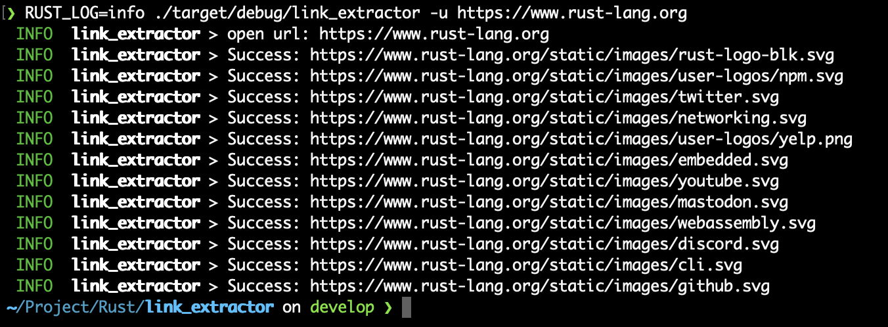

# link_extractor
CLI for extract images links from your web site

Usage:
```bash
./target/debug/link_extractor -help

Cli (Command Line Interface) for extracting link from yours web site

Usage: link_extractor [OPTIONS] --url <URL>

Options:
  -u, --url <URL>      Your web site url
  -p, --proxy <PROXY>  Your proxy url
  -t, --tag <TAG>      Html Tag , default is img [default: img]
  -a, --attr <ATTR>    Attribute name of Tag , default is src [default: src]
  -h, --help           Print help
  -V, --version        Print version
```
Example:
```bash
RUST_LOG=info ./target/debug/link_extractor -u https://www.rust-lang.org
```
Output:



